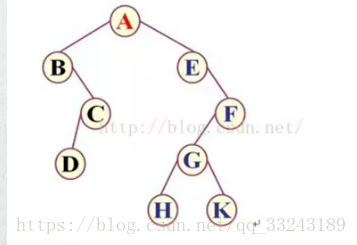
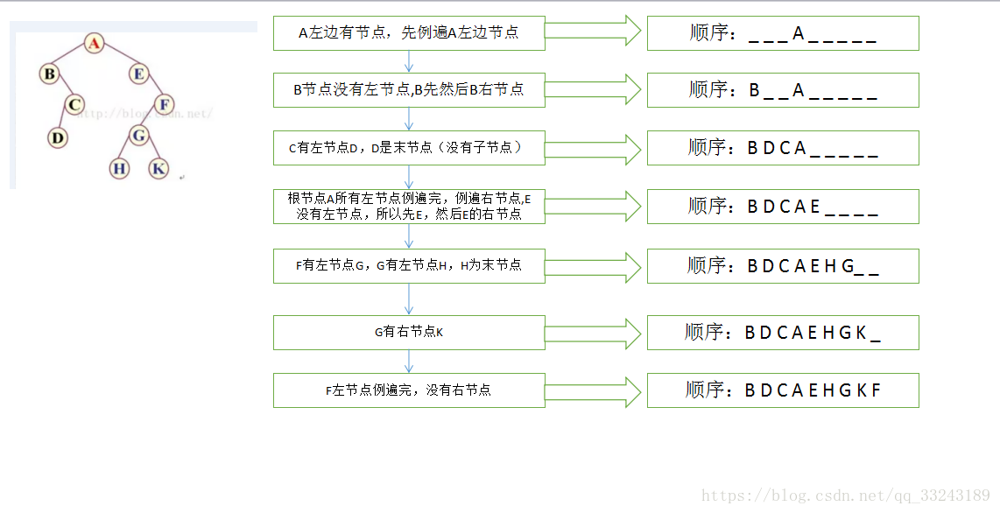

# 面经
## 算法
### 1、费波纳数列
### 2、二叉树

- 二叉树的遍历：前序、中序、后序

二叉树

比如上图正常的一个满节点，A：根节点、B：左节点、C：右节点，前序顺序是ABC（根节点排最先，然后同级先左后右）；中序顺序是BAC(先左后根最后右）；后序顺序是BCA（先左后右最后根）。

二叉树

比如上图二叉树遍历结果

前序遍历：ABCDEFGHK

中序遍历：BDCAEHGKF

后序遍历：DCBHKGFEA

> 其中比较关键的是中序遍历：

中序遍历

# javaScript

## API

- slice(first, end)

- first:首位位置

- end:末尾位置

- 遵循 包前不包后

## 原码、反码、补码

- 原码：一个整数，按照绝对值大小转换成的二进制数，称为原码。

- 反码：将二进制数按位取反，所得的新二进制数称为原二进制数的反码。

- 补码：反码加1称为补码。

- 可以使用 `&0xFFFFFF`来计算原码的补码。

## << >> <<< >>> 等符号

- `<<`表示左移移，不分正负数，低位补0；　

- `>>`表示右移，如果该数为正，则高位补0，若为负数，则高位补1；

- `>>>`表示无符号右移，也叫逻辑右移，即若该数为正，则高位补0，而若该数为负数，则右移后高位同样补0

- `&`按位与
- `|`按位或

## 